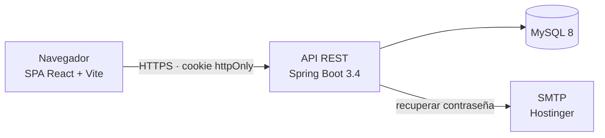

# Arquitectura

Estado del sistema al 15 de septiembre de 2026.

## Panorama general

Inventiory es una aplicación web con dos piezas desplegables: una API REST en Spring Boot y una SPA en React. Ambas viven en este monorepo y se despliegan por separado.



La autenticación es por **JWT guardado en una cookie httpOnly**. El token nunca pasa por JavaScript: lo emite el backend al iniciar sesión y el navegador lo reenvía solo. Por eso todas las llamadas del frontend usan `withCredentials: true`.

## Stack

| Capa | Tecnología |
|---|---|
| Backend | Java 17, Spring Boot 3.4.3, Spring Security 6, Spring Data JPA, Hibernate 6.6 |
| Base de datos | MySQL 8 (en desarrollo, contenedor Docker) |
| Autenticación | JJWT 0.11.5 sobre cookie httpOnly |
| Correo | Spring Boot Starter Mail sobre SMTP |
| Frontend | React 18, Vite, React Router |
| Estado/red | Axios con `withCredentials`, Context API |
| UI | Bootstrap, NextUI, Lucide, React Hook Form |
| Gráficos | Chart.js, Recharts |
| Reportes | `@react-pdf/renderer` |
| Testing | JUnit 5 + Mockito (backend), sin tests en frontend |

## Backend

### Organización

El código se agrupa **por feature**, no por capa técnica. Cada módulo de negocio contiene su propia estructura vertical:

```
com.imperial_net.inventioryApp.<modulo>
├── controller/    endpoints REST
├── dto/           objetos de entrada y salida
├── model/         entidades JPA
├── repository/    acceso a datos (Spring Data)
└── service/       reglas de negocio
```

Esto permite leer y modificar una funcionalidad completa sin saltar entre carpetas lejanas.

### Módulos

**De negocio** (con la estructura completa de cinco capas):

| Módulo | Responsabilidad |
|---|---|
| `products` | Catálogo de productos y marcas |
| `purchases` | Compras a proveedores. Carga el stock y define el costo. **Derogado por [ADR 0001](adr/0001-stock-sin-costeo-fifo.md): pendiente de eliminación** |
| `sales` | Ventas. El cálculo de costo y ganancia por venta se elimina por [ADR 0001](adr/0001-stock-sin-costeo-fifo.md) |
| `expenses` | Gastos operativos, segmentados por categoría (enum fijo) |
| `clients` | Clientes del comercio |
| `providers` | Proveedores |
| `companies` | Datos fiscales del negocio |
| `users` | Usuarios, roles y recuperación de contraseña |

El módulo de movimientos de stock reemplaza a `purchases`: registra entradas,
ajustes, pérdidas y devoluciones sin importes. El detalle del modelo está en
[domain-model.md](domain-model.md).

**De consulta** (sin entidades propias; leen de los módulos de negocio):

| Módulo | Responsabilidad |
|---|---|
| `dashboard` | Métricas agregadas de la pantalla principal |
| `reports` | Rentabilidad, ingresos diarios, mensuales y anuales |

**Transversales:**

| Paquete | Responsabilidad |
|---|---|
| `auth` | Inicio y cierre de sesión, sesión activa |
| `security` | `SecurityConfig`, `JwtService`, filtro de cookie, proveedor de autenticación |
| `exceptions` | Excepciones de dominio y `GlobalExceptionHandler` |
| `email` | Envío de correos |
| `suscriptions` | Registro desde la landing y planes FREE/PRO |
| `config` | Configuración de infraestructura (correo) |

### Manejo de errores

Los controladores no capturan excepciones de negocio. Cada módulo lanza su propia excepción (`ProductException`, `ClientException`, `ExpenseException`…) y un único `GlobalExceptionHandler` las traduce a respuestas HTTP.

### Configuración por perfiles

| Perfil | Archivo | Versionado | Uso |
|---|---|---|---|
| `dev` | `application-dev.properties` | No | Desarrollo local |
| `prod` | `application-prod.properties` | Sí | Producción, con `${VARIABLES}` |
| — | `application-example.properties` | Sí | Plantilla de referencia |

Los valores sensibles nunca se escriben en un `.properties`: se inyectan como variables de entorno desde `backend/.env`. Detalle en el [README](../README.md).

Lo que cambia entre entornos está externalizado: orígenes CORS, rutas públicas y atributos de la cookie de sesión (`secure`, `sameSite`, `maxAge`).

## Frontend

### Organización

Espeja la del backend: agrupación por feature.

```
src/
├── features/<feature>/pages/    pantallas
├── components/                  componentes compartidos (DataTable, Navbar, modales)
├── contexts/                    AuthContext: sesión del usuario
├── config/                      axiosConfig: cliente HTTP único
├── router/                      AppRouter y ProtectedRoute
├── layout/                      estructura común de página
└── styles/                      CSS
```

Las features son: `auth`, `products`, `buys`, `sales`, `stocks`, `clients`, `providers`, `expenses`, `reports`, `dashboard`, `users`, `landing`.

`buys` queda derogada por [ADR 0001](adr/0001-stock-sin-costeo-fifo.md): su reemplazo es el movimiento de stock dentro de `stocks`.

### Sesión

`AuthContext` mantiene el usuario autenticado. Al montar, consulta `/auth/me`: si la cookie es válida el backend devuelve la sesión, si no, queda sin usuario. No hay token en `localStorage` — por diseño, para que un XSS no pueda robarlo.

`ProtectedRoute` bloquea las rutas privadas, y las rutas de administración se montan solo si el rol lo permite.

### Comunicación con la API

Todo pasa por `config/axiosConfig.js`, que define la URL base desde `VITE_API_URL` y activa `withCredentials`. No debería haber llamadas HTTP fuera de ese cliente.

## Decisiones estructurales vigentes

1. **Monorepo.** Backend y frontend evolucionan juntos y casi todo cambio funcional toca los dos. Un repositorio único mantiene el cambio en un solo commit y la documentación sincronizada con el código.
2. **Agrupación por feature.** Sobre agrupar por capa técnica, porque el trabajo diario es por funcionalidad.
3. **JWT en cookie httpOnly.** Sobre `localStorage`, para que el token quede fuera del alcance de JavaScript.
4. **Stock sin costeo.** El producto tiene precio de venta y ningún costo; el stock se mueve sin importes y la rentabilidad se calcula a nivel negocio como ventas menos gastos. Deroga el costeo FIFO sobre lotes de compra que regía antes. El porqué está en [ADR 0001](adr/0001-stock-sin-costeo-fifo.md) y el modelo en [domain-model.md](domain-model.md).

## Limitaciones conocidas

Registradas para que no se descubran de nuevo. Cada una debería convertirse en un ADR cuando se decida cómo resolverla.

| Tema | Situación |
|---|---|
| **Aislamiento entre negocios** | Los datos se filtran por `User`, no por `Company`. Dos empleados del mismo comercio verían inventarios distintos. |
| **Modelo de roles** | `ADMIN` designa al dueño de la plataforma, no al dueño de un negocio. Un cliente no puede gestionar a sus empleados. |
| **Autorización en endpoints** | `SecurityConfig` exige autenticación pero no distingue roles; no hay `@PreAuthorize`. Las restricciones por rol solo existen en la interfaz. |
| **Cuenta administradora por defecto** | `UserService.insertAdminUser()` crea `admin@admin.com` con contraseña `admin` en cada arranque, incluido producción. |
| **Cobertura de tests** | Tres archivos de test en todo el backend. El cálculo FIFO, que es el núcleo del negocio, no está cubierto. |
| **Despliegue** | Hay `Dockerfile` para el backend, pero no `docker-compose.yml`, así que nada inyecta todavía las variables de entorno de producción. |
| **Tipado en frontend** | JavaScript sin tipos en unos 160 archivos. |
| **Costeo FIFO todavía en el código** | [ADR 0001](adr/0001-stock-sin-costeo-fifo.md) derogó el costeo por lotes, pero el código aún implementa `purchases`, la feature `buys` y la ganancia por producto. Falta la eliminación y la migración de lotes a movimientos de stock. |

## Documentos relacionados

- [Modelo de dominio](domain-model.md) — entidades y reglas de negocio
- [Visión de producto](product-vision.md) — qué problema resuelve y para quién
- [Decisiones de arquitectura](adr/) — el porqué de cada elección
