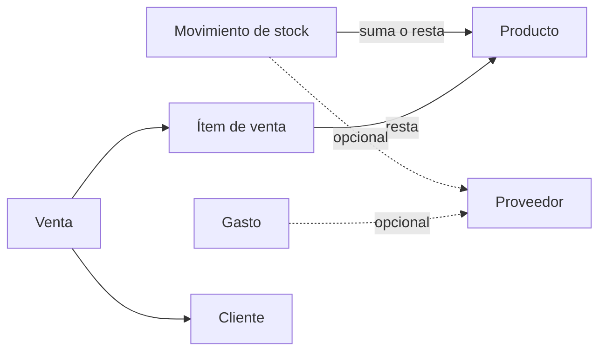

# Modelo de dominio

Entidades y reglas de negocio del sistema. El modelo que describe este documento
es el que fija [ADR 0001](adr/0001-stock-sin-costeo-fifo.md): **stock sin costeo**.
El código todavía implementa el costeo FIFO por lotes de compra que ese ADR derogó
—ver limitaciones en [architecture.md](architecture.md)—, así que este documento
describe el destino, no el estado actual del código.

## Panorama

Las dos únicas cosas que mueven el stock son el **movimiento de stock** y el **ítem
de venta**. El dinero vive en dos lugares independientes: la **venta** (entra) y el
**gasto** (sale).

## Producto

El catálogo del comercio.

| Dato | Obligatorio | Notas |
|---|---|---|
| Nombre | Sí | Único dato de identidad obligatorio |
| Código de barras | **No** | Único cuando está cargado; muchos productos pueden no tenerlo |
| Precio de venta | Sí | A cuánto se vende. No hay costo |
| Stock actual | Sí | Se carga un stock inicial al crear el producto |
| Stock mínimo | Sí | Lo define el dueño, no lo calcula el sistema |

Reglas:

- **El código de barras es opcional.** La unicidad aplica solo a los productos que
  tienen uno: varios productos sin código no se consideran duplicados. Hay rubros
  enteros sin código de barras y obligar a inventarlo ensucia los datos.
- **La búsqueda es un solo campo** que resuelve por código o por nombre. No hay dos
  buscadores ni un selector de criterio.
- **El producto no tiene costo.** Por lo tanto no hay margen, ni ganancia por
  producto, ni valuación del inventario a costo.
- El precio guarda **historial con fecha de vigencia**: cambiar el precio hoy no
  altera el importe de una venta registrada ayer.

## Movimiento de stock

Todo cambio de stock que no es una venta. Reemplaza al módulo de compras.

| Dato | Obligatorio |
|---|---|
| Producto | Sí |
| Cantidad | Sí |
| Fecha | Sí |
| Motivo | Sí |
| Proveedor | No |
| Nota | No |

Motivos (enum): `INGRESO`, `AJUSTE`, `PERDIDA`, `DEVOLUCION`.

Reglas:

- **Un movimiento no lleva importes.** La mercadería y la plata se registran por
  separado porque en el comercio chico rara vez ocurren el mismo día.
- El movimiento **no se edita ni se borra**: se corrige con otro movimiento. El
  historial tiene que explicar por qué el stock es el que es.
- `INGRESO` y `DEVOLUCION` suman; `PERDIDA` resta; `AJUSTE` lleva el stock al valor
  contado, sumando o restando la diferencia.

## Venta

| Dato | Obligatorio |
|---|---|
| Fecha | Sí |
| Ítems (producto, cantidad, precio unitario) | Sí |
| Total | Sí, calculado |
| Cliente | No |

Reglas:

- Cada ítem **guarda el precio al que se vendió**, no una referencia al precio
  actual del producto.
- La venta **descuenta stock directo**, sin lotes.
- **Stock insuficiente avisa pero no bloquea.** La venta real ya ocurrió y el papel
  nunca la habría impedido.
- La venta no calcula costo ni ganancia.

## Gasto

Todo lo que sale de la caja.

| Dato | Obligatorio |
|---|---|
| Fecha | Sí |
| Monto | Sí |
| Categoría | Sí |
| Proveedor | No |
| Nota | No |

Categorías (enum fijo): `PROVEEDORES`, `EMPLEADOS`, `ALQUILER`, `SERVICIOS`,
`IMPUESTOS`, `OTROS`.

Reglas:

- La categoría **no es una entidad administrable** por el dueño: es una lista corta
  y estable, para que comparar un mes contra otro tenga sentido. Agregar una
  categoría es cambio de código y migración.
- La compra de mercadería se registra acá, con categoría `PROVEEDORES`. No se
  deriva del movimiento de stock.

## Rentabilidad

**Resultado del período = ventas del período − gastos del período.**

Es una magnitud **del negocio**, nunca del producto. Por producto el sistema
informa **rotación y facturación** (unidades vendidas e importe facturado), y nada
más.

El reporte de gastos desglosa el total por categoría y compara mes contra mes: es
lo que responde "en qué se me fue la plata".

## Documentos relacionados

- [ADR 0001](adr/0001-stock-sin-costeo-fifo.md) — por qué se eliminó el costeo
- [Visión de producto](product-vision.md) — qué problema resuelve y para quién
- [Arquitectura](architecture.md) — estado del sistema y limitaciones conocidas
